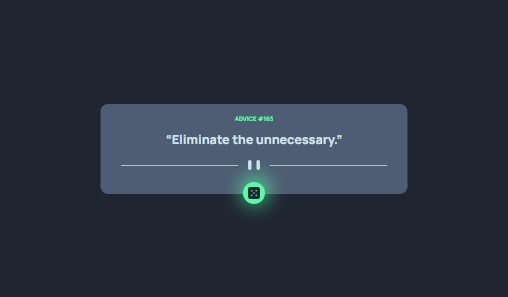

# Frontend Mentor - Advice generator app solution

This is a solution to the [Advice generator app challenge on Frontend Mentor](https://www.frontendmentor.io/challenges/advice-generator-app-QdUG-13db).

## Table of contents

- [Overview](#overview)
  - [Screenshot](#screenshot)
- [My process](#my-process)
  - [Built with](#built-with)
  - [What I learned](#what-i-learned)
- [Author](#author)

## Overview

### Screenshot



## My process

### Built with

- SCSS
- Flexbox
- CSS Grid
- React JS
- laptop-first workflow

### What I learned

    I understood how to handle http requests and make use of the useEffect hook when programming asynchronously.

```react
useEffect(() => {
    let data;
    const getAdvice = async () => {
      try {
        if (hasLoaded) {
          const res = await fetch("https://api.adviceslip.com/advice");

          if (!res.ok) {
            throw new Error("Something went wrong!!");
          }

          const adviceData = await res.json();

          for (const key in adviceData) {
            data = adviceData[key];
          }

          setAdvice(data);
        }
      } catch (err) {
        console.log(err.message);
      }
    };

    getAdvice();
  }, [hasLoaded]);
```

## Author

- Frontend Mentor - [@ejim11](https://www.frontendmentor.io/profile/@ejim11)
- Twitter - [@favourejim56](https://www.twitter.com/@favourejim56)
